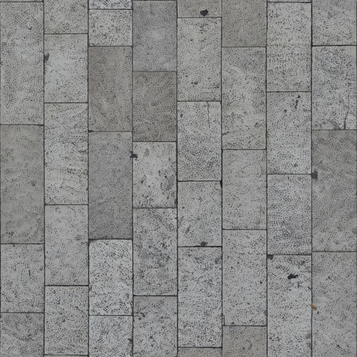

# A-frame Workshop for Beginners

Based on the "Official starter slides for giving talks and presentations about A-Frame".
https://github.com/aframevr/aframe-presentation-kit

Here you'll learn how to build a VR scene using A-frame. For this workshop basic understanding of html is recommended but not required.

Slides for this workshop are here:
https://docs.google.com/presentation/d/1ECOqC97oNoapnDNFsTYWpEZgUCt2PDmUzeLRJ3mjgZQ/edit?usp=sharing

## 0. Setting Things Up
1. Install Git
2. Install Sublime Text 3 or other text editor
3. (Mac/Linux) Install ` node `
4. (Mac/Linux) Install ` live-server `
```
npm install -g live-server
```
5. (Windows) Use Mongoose to create a local server:
https://cesanta.com/

## 1. Create a Scene

This is the simplest way of starting an aframe scene. Just copy this boilerplate code:

```html
<html>
  <head>
    <script src="https://aframe.io/releases/0.8.0/aframe.min.js"></script>
  </head>
  <body>
    <a-scene>


    </a-scene>
  </body>
</html>
```
note: You should only have one ` <a-scene> ` inside each html document. This is where you put all the A-frame code.

## 2. Add an entity with components to your scene

Start by adding a cube:

```html
<a-box>
</a-box>
```
Check your browser. Where is the cube?

Put it in front of the camera by adding a `position` component and changing its coordinates:

```html
<a-box
  position="0 0 0">
</a-box>
```
A-frame uses a right-hand coordinate system with the z-axis coming out of the screen like this:


**Challenge:** add color, rotation and scale to change how the cube looks. The color component works with hex colors and with css-like colors - gray, white, red, etc.

## 3. Build a Street Lamp

**Challenge:** - Build a simple street lamp using only primitives (box, cylinder, sphere, etc).
Pro-tip: put all your entities inside another entity to make it easier to move, scale, and rotate once you're finished with the design.

```html
<a-entity position="0 0 -3" rotation="0 45 0">
  <a-box
    scale="0.1 5 0.1"
    color="gray">
  </a-box>
  <a-box
    scale="0.1 0.1 1.5"
    position="0 2.5 0.75"
    color="gray">
  </a-box>
  <a-box
    scale="0.3 0.1 0.6"
    position="0 2.42 1.3"
    color="gray">
  </a-box>
  <a-sphere scale="0.1 0.1 0.2"
    position="0 2.42 1.3"
    color="yellow">
  <a-sphere>
<a-entity>
```

## 4. Deploy your scene

1. Create a repository on Github, push your local repository and set the *main* branch to be hosted.
2. Push your code to that repository:
```
git add .
git commit -m "my commit message"
git push origin master
```
The **commit message** should contain what you've done since the last commit. This is the first commit so it's common to put **"start repo"**.

***Go look at your webpage***, see if everything looks fine - use a VR headset if you have one!

Now you can continue working on our scene, knowing that everything is looking the way it should.

## 5. Add textures

1. Find an image like this one:
http://texturelib.com/Textures/brick/pavement/brick_pavement_0099_02_preview.jpg
Tip: **get a square image** - it's easier to work with.
2. Save it with a simpler name like `ground.jpg` on the same folder as your project
3. Import it as an asset (all images, 3d models and sounds should be imported like this):
```html
<a-assets>
  
</a-assets>
```
When you need to use these assets you just need to refer to them by their *id*.

4. Create a plane for the ground. Make it 40x40 or more. Add the texture like this:
```html
<a-plane src="#ground"></a-plane>
```
Notice we refer to it by doing *#id*.

## 6. Add a 3d model

As you've seen with the street lamp earlier, using primitives can make the code quite lengthy even for simple designs.
Imagine doing a house or a car... you'd have hundreds or thousands of lines of code.
Fortunaely you can import 3d models made with software like Blender, 3dsmax, etc.

1. Find a model that you like on https://poly.google.com/
Look for the models that are downloadable, preferably in OBJ format.
You should get a *.zip* with two files: model-xpto*.obj* and model-xpto*.mtl*

2. Import the files into <a-assets> and put them in an <a-entity>:

```html
<a-asset-item id="tree-obj" src="/path/to/tree.obj"></a-asset-item>
<a-asset-item id="tree-mtl" src="/path/to/tree.mtl"></a-asset-item>
```

```html
<a-entity
  obj-model="obj: #car-obj; mtl: #car-mtl">
</a-entity>
```

3. Adjust the scale until it looks right.

**Optional Challenge**: Make the car drive from left to right of the screen using <a-animation>. https://aframe.io/docs/0.7.0/core/animations.html

## 7. Add a skybox

1. Look for *equirectangular* pictures like this one:
https://www.google.pt/search?client=ubuntu&hs=9Y1&channel=fs&dcr=0&tbm=isch&q=equirectangular&spell=1&sa=X&ved=0ahUKEwjVsL-3pvjXAhVK5xoKHQnsBxkQvwUImQEoAA&biw=1708&bih=835&dpr=0.8#imgrc=nJ7brK9YVhC_eM

2. Import it just like you did with the *ground* texture:
```html
<a-assets>
  
</a-assets>
```

```
<a-sky src="#sky"></a-sky>
```

## 8. Lights

Getting the lights and shadows right is one of the hardest things to do in A-frame. It is also one of the most important things to add depth to a scene.

1. Add an *ambient* light with low intensity to make it look like it's night time.

**Note**: by default the skybox is not affected by the lighting in your scene. To change that you must change the material:
```html
<a-sky
  src="#sky"
  material="shader: standard">
</a-sky>
```

2. Add a spot light to the street lamp:
```html
 <a-entity light="type:spot"></a-entity>
```

Play around with the rotation, angle, color and penumbra until you find something you like. **Use the inspector!**

## 9. Shadows

Are there any shadows? Do they look right? Read more about shadows here: https://aframe.io/docs/0.7.0/components/shadow.html

1. Add `castShadow: true` to the spotlight:
```html
<a-entity light="type:spot; castShadow: true"></a-entity>
```

2. Add the `shadow` component to the objects that receive and cast shadows:
```html
<a-entity
  obj-model="obj: #car-obj; mtl: #car-mtl"
  shadow="receive: true">
</a-entity>
```
Tip: **use the inspector** to work with the shadow properties of each entity.

3. Deploy your scene again:
```
git add .
git commit -m "Add lights and shadows"
git push origin master
```
See if the floor, skybox and 3d model are loaded correctly.

## 10. Add fog

1. Apply fog to <a-scene>.
Go easy on the fog to help you *mask* the horizon whyle keeping the sky visible; Or go crazy and make a super creepy scene.
Play with color and type to achieve the look you want.
https://aframe.io/docs/0.7.0/components/fog.html


